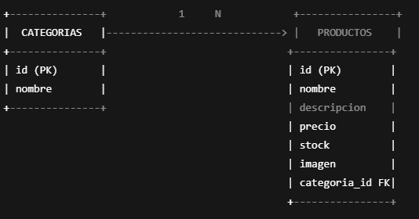
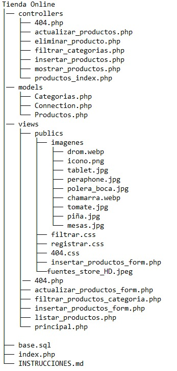

# 📦 Base de Datos - Tienda Online

## 📊 Modelo Relacional

## 📁 Estructura de Carpetas

# 📦 Estructura del Proyecto - Tienda Online

Este proyecto representa una tienda en línea básica, con separación en capas: **controladores**, **modelos** y **vistas**.

---

## 📁 controllers/
Contiene la lógica del sistema, acciones o intermediarios entre vistas y modelos.

- `404.php`: Página de error personalizada para cuando no haya conexion con la base de datos.
- `actualizar_productos.php`: Actualiza los datos de un producto en la base de datos.
- `eliminar_producto.php`: Elimina un producto de la base de datos.
- `filtrar_categorias.php`: Filtra los productos según la categoría seleccionada.
- `insertar_productos.php`: Inserta un nuevo producto usando los datos del formulario.
- `mostrar_productos.php`: Recupera productos desde la base de datos para mostrarlos.
- `productos_index.php`: Punto de entrada o índice para la gestión de productos.

---

## 📁 models/
Contiene las clases que representan y manipulan los datos del sistema.

- `Categorias.php`: Modelo para las operaciones CRUD sobre las categorías.
- `Connection.php`: Clase encargada de la conexión con la base de datos.
- `Productos.php`: Modelo con métodos para gestionar productos (insertar, actualizar, eliminar, listar).

---

## 📁 views/
Contiene las interfaces visuales que el usuario final verá.
- `404.php`: Vista mostrada cuando hay un error de ruta.
- `actualizar_productos_form.php`: Formulario para editar productos.
- `filtrar_productos_categoria.php`: Vista con resultados filtrados por categoría.
- `insertar_productos_form.php`: Formulario para insertar productos.
- `listar_productos.php`: Lista de productos registrados.
- `principal.php`: Vista principal del sitio web .

### 📁 publics/imagenes/
Contiene imágenes de productos o elementos visuales del sitio.

- `drom.webp`, `tablet.jpg`, `peraphone.jpg`, `polera_boca.jpg`, etc.: Imágenes de productos de distintas categorías .

### 📁 publics/
Archivos estáticos y formularios.

- `filtrar.css`, `registrar.css`, `404.css` etc.. : Hojas de estilo CSS para dar formato a las vistas.

---

## 📄 Archivos raíz

- `base.sql`: Script SQL que crea la base de datos y tablas e inserta datos iniciales.
- `index.php`: Punto de entrada principal de la aplicación web.
- `INSTRUCCIONES.md`: Documento con instrucciones para configurar o usar el proyecto.

---

## ✅ Observación

- El proyecto está dividido de forma clara siguiendo el patrón MVC (Modelo - Vista - Controlador).

## ✅ Arrancar el sistema
1️⃣ **Configurar la base de datos** → Copiar las consultas del archivo `base.sql` y pegar en MySQL.  
2️⃣ **Modificar `Connection.php`** → Si en caso de que su MYSQL tenga contraseña, poner la contraseña en `Connection.php`   
